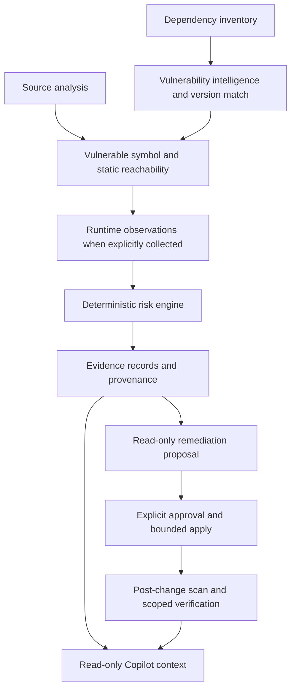
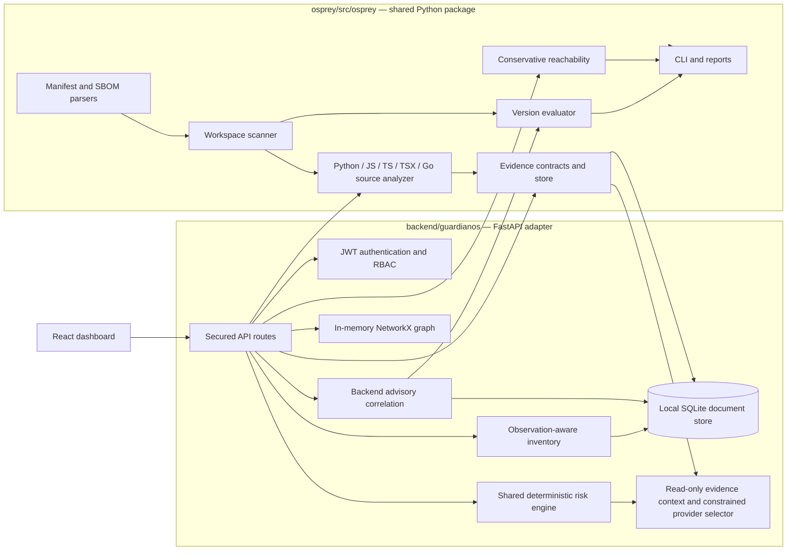

# Osprey Architecture

**Updated:** 2026-10-09
**Scope:** CLI, FastAPI backend, React UI, and the shared Python package.

Osprey is an evidence-driven dependency vulnerability and reachability platform. A package advisory establishes package-level vulnerability only when version matching supports it. A source-level reachability conclusion additionally requires supported route, call, dependency-use, and advisory-symbol evidence. Missing evidence remains `UNKNOWN`.

## Current architecture

### Product boundary and end-to-end evidence flow

Osprey is a local evidence-driven dependency triage system. Its implemented path is inventory and advisory matching, followed by supported symbol/reachability analysis, optional bounded runtime observations, deterministic risk, evidence persistence, explicit remediation approval, and a scoped post-change verification. Copilot is a downstream read-only explanation layer. A missing observation stays `UNKNOWN`; no layer proves a successful exploit or public deployment exposure.



The arrow from evidence to Copilot is intentionally downstream: model-provider output cannot change scanner results, risk values, evidence identifiers, or remediation state.



The CLI and API share workspace inventory scanning, the ecosystem-aware version evaluator, evidence types, static source/reachability analysis, and the deterministic risk calculation in `osprey/src/osprey/risk.py`. CLI and backend adapters normalize their findings into one evidence contract; the backend maps the shared score, level, decision, factors, and limitations into its existing API model. Advisory ingestion and graph services remain adapter-specific.

Evidence IDs and hashes use canonical JSON. The content hash identifies observed content; the record hash detects changes to the stored envelope, including its timestamp and metadata. Normalized risk inputs/results and reachability conclusions are retained as structured observations on their evidence records. These hashes provide integrity checking but do not make SQLite immutable, establish trusted time or source authenticity, or provide forensic chain-of-custody. See [EVIDENCE_MODEL.md](EVIDENCE_MODEL.md) for the evidence taxonomy and limits.

### Repository modules and responsibilities

| Module | Responsibility | Evidence boundary / current limit |
|---|---|---|
| `osprey/src/osprey/parsers/` | npm, Python, Dockerfile, Compose and SBOM-related file parsing | Reads files as text; does not install dependencies or execute application code. |
| `osprey/src/osprey/scanner.py`, `runtime.py` | Shared workspace scan, component observations, advisory calls, report orchestration, bounded installation inspection and explicit Python instrumentation | Scans do not execute or attach to target apps. Python runtime instrumentation is opt-in and process-local; other runtime states remain unknown. |
| `osprey/src/osprey/core/versioning.py` | Shared ecosystem-aware matching for OSV-style introduced/fixed/last-affected events and exact versions | Unsupported or incomparable versions return unknown; ecosystem edge cases remain bounded by comparator support. |
| `osprey/src/osprey/core/models.py`, `core/evidence.py`, `core/provenance.py` | Canonical observations, typed evidence, stable IDs, hashes, and analysis/risk provenance | Core CLI store is in-process; backend uses a SQLite-backed adapter. Normalized reachability/risk/limitation observations are retained; raw source text is represented by hashes and locations, not stored by default. |
| `osprey/src/osprey/analyzers/source.py` | Python AST and Tree-sitter JS/TS/TSX/Go extraction of imports, selected functions/calls, and route declarations | Static syntax subset only; no complete framework semantics, cross-file resolution, reflection, or dynamic flow. |
| `osprey/src/osprey/analyzers/reachability.py` | Connects observed route handlers through local call edges to an advisory-mapped symbol | Uses `REACHABLE`, `NOT_REACHABLE`, or `UNKNOWN`; negative conclusions are limited to submitted files and supported syntax. |
| `osprey/src/osprey/risk.py` | Shared deterministic evidence-aware risk score, level, and action decision | Weighted composite over observed factors; missing EPSS, KEV, exposure, version, runtime, and reachability evidence remains unavailable. This is not an industry scoring standard. |
| `backend/guardianos/api/` | FastAPI routes, bearer-token authentication, role checks, request size bounds | Reads require viewer; analysis/ingestion require security engineer; approval and inventory clear require admin. |
| `backend/guardianos/inventory/` | CycloneDX, SPDX, Syft normalization and adapter to the shared workspace scanner | Stores observations by observation ID so repeated package/PURL sightings remain distinct. |
| `backend/guardianos/intel/` | Backend advisory lookup, shared version evaluation, vulnerability findings | Bundled advisory records are fixtures; OSV is queried when a local record is unavailable. Backend EPSS/KEV collectors are not configured, so those inputs remain unavailable unless explicit evidence is supplied. |
| `backend/guardianos/storage/` | SQLite JSON document records and audit event persistence | Local single-instance store; not PostgreSQL, distributed storage, or tamper-proof audit. |
| `backend/guardianos/graph/` | NetworkX graph for current process | Rebuilt from inventory on start; endpoint/vulnerability graph state is not a durable graph database. Neo4j settings/adapter are not the active default. |
| `backend/guardianos/exposure/`, `risk/`, `attackpath/` | User endpoint assertions and thin adapter to the shared risk engine | A source route or user assertion does not prove public ingress or cloud privilege. Normal attack-path service returns no cloud path absent evidence; demo fixture is separate. |
| `backend/guardianos/remediation/` | Version recommendations, admin approval record, local inventory recheck | No Git branch, diff, PR, deployment, or production verification is performed. |
| `backend/guardianos/ai/` | Deterministic analyst compatibility routes and finding-scoped evidence copilot | Evidence-only by default; optional model may select ordering of server-created fact keys only. All claims are rendered by Osprey. See [AI security boundary](ai-security.md). |
| `frontend/` | React client for API results and labeled demo | No separate frontend test suite is configured. |

## Data flow

### CLI workspace analysis

1. The CLI reads supported manifests, lockfiles, Docker/Compose declarations, and bounded source files.
2. It preserves component observations and records locations and file hashes.
3. OSV version ranges are evaluated through the shared matcher; the CLI can also query EPSS and CISA KEV.
4. Static analysis records imports, route declarations, local function calls, and evidence IDs.
5. Reachability is `REACHABLE` only when the supported call path reaches an advisory-provided vulnerable symbol. No symbol mapping or incomplete analysis yields `UNKNOWN`.
6. CLI maps normalized finding evidence into the shared deterministic engine. It returns a normalized score/level and `ACT NOW`, `PLAN`, `MONITOR`, `IGNORE`, or `UNKNOWN`; these outputs do not imply runtime or deployment exposure observations.

### Backend and dashboard

1. FastAPI authenticates a configured user and checks their role before a protected route runs.
2. SBOM or bounded workspace scan input becomes component observations. Manifest/lockfile observations remain separate; a label such as `environment=production` is metadata, not runtime proof.
3. Inventory, SBOM metadata, findings, remediation proposals, evidence, user endpoint assertions, upstream input records, and audit events are written to SQLite.
4. The NetworkX graph is a derived in-memory view. Inventory nodes and dependency edges are rebuilt from persisted observations on startup.
5. A normal local workspace scan uses the shared scan's bounded source analysis, then links matched backend findings to advisory-mapped symbols. It persists reachability status, confidence, path, explanation, limitations, and evidence IDs, then passes normalized evidence to the same risk engine used by the CLI. The optional reachability endpoint can instead analyze a caller-submitted bounded bundle.
6. The React UI renders API results. Demo fixture values are labeled simulated and are not used as ordinary inventory evidence.

### Evidence copilot

The copilot runs after deterministic finding/evidence creation. It loads one organization-scoped persisted finding and integrity-verifies linked evidence records, then constructs a bounded context. The default provider is offline and deterministic. An optional model provider may select the ordering of Osprey fact keys, but cannot supply claims, scores, evidence IDs, or state transitions. Osprey renders claims from verified records; malformed provider output falls back to evidence-only output. The copilot never writes finding/evidence/remediation state. A separate safe audit event records request metadata. See [AI security boundary](ai-security.md).

## Evidence model and flow

The shared `Evidence` record contains `id`, `type`, `source`, `location`, `timestamp`, `confidence`, `content_hash`, and metadata. Types include manifest, lockfile, SBOM, source file, import, route, function, advisory, EPSS, CISA KEV, container image, runtime observation, and user input.

Deterministic collectors and analyzers create evidence from their inputs. Findings refer to evidence IDs. The SQLite evidence adapter reloads records across backend restarts and omits raw source/advisory bodies. The evidence-summary code can cite existing evidence but does not create or change evidence or a deterministic finding.

Evidence strength must remain bounded by source:

- A manifest establishes declared intent; a lockfile records a package-manager resolution.
- An SBOM establishes what its producer reported at its stated scope. SBOM ingestion rejects a request to label all components `RUNNING`.
- Static source routes establish route declarations, not external network access or authentication.
- A user-supplied endpoint profile is an assertion recorded as `USER_INPUT`, not cloud-discovered exposure.
- The only runtime collector is an explicit Python helper observing an already-imported module and optionally a caller-wrapped callable. No process attachment, container runtime state, cloud IAM, production deployment, or live external ingress evidence is collected.

## Security boundaries

- Repository files, SBOMs, advisory responses, commit text, and user input are untrusted data. Scanning never executes project code.
- JWT signing uses a configured secret of at least 32 bytes; production app creation fails without it. Passwords use salted PBKDF2-SHA256 hashes. Users and roles come from `AUTH_USERS_JSON` configuration.
- Role hierarchy: `viewer` reads; `security_engineer` may ingest and analyze; `admin` may approve remediation recommendations and clear inventory. Approval actor identity comes from the token, not the request body.
- The ASGI request middleware enforces a 10 MiB default request-body cap, including requests without a trustworthy `Content-Length`.
- Local path scans are confined to `WORKSPACE_ROOT` (or the process working directory when unset). The reachability API accepts relative bundle paths and bounded text rather than arbitrary server paths.
- SQLite audit rows are append-only through the service API, but a local operator can alter the database file. Do not call this tamper-proof or immutable.
- Demo data is a deliberately seeded fixture. It includes fictional cloud/endpoint/lifecycle facts and must not be presented as observations of a real environment.

## Target architecture

The desired package boundaries are:

```text
osprey/src/osprey/
  core/models/             canonical component, finding, exposure, and result contracts
  core/evidence/           provenance records and evidence references
  core/vulnerability/      advisory normalization and version range evaluation
  core/inventory/          observation-aware components and declared/installed/running drift
  core/exposure/           source entrypoint observations
  core/reachability/       conservative call graph and reachable/not-reachable/unknown
  core/risk/               shared deterministic prioritization
  collectors/              npm, PyPI, OSV, EPSS, CISA KEV, optional runtime sources
  analyzers/               source, dependency usage, and reachability
  cli/                     command and report adapters
  api/                     authenticated API adapter
  storage/                 tested SQLite and later database adapters
frontend/                  API-only presentation client
```

### Intended responsibilities

- **Inventory:** retain every observation with ecosystem, name, version, PURL, source, location, dependency type, and independently sourced declared/installed/running versions. Derive drift only among comparable observations.
- **Vulnerability intelligence:** normalize advisories once, preserve source and timestamp, evaluate ecosystem ranges with explicit boundaries, and keep unavailable severity/EPSS/KEV values unknown.
- **Exposure:** emit source route observations with framework, method, route, file, line, and confidence. Do not infer cloud infrastructure or internet reachability from a listener alone.
- **Dependency usage and reachability:** extract imports and local calls, use advisory-supported vulnerable symbols, and label unsupported dynamic/cross-file flows unknown.
- **Risk:** consume the same finding/evidence contracts from CLI and API. Every priority should show inputs, rules, evidence IDs, and uncertainty.
- **API/UI:** keep authentication, authorization, storage, and serialization at the adapters; both should consume the shared engine.
- **Runtime collection:** current support is bounded local installation metadata plus explicit process-local Python instrumentation. Do not infer universal runtime visibility.

## Unified risk scoring

`osprey/src/osprey/risk.py` is the sole scoring and decision implementation. CLI and backend convert their distinct finding records to `RiskEvidence`, then use `calculate_risk`; adapters only map the shared result into CLI/HTTP response shapes. For the same normalized evidence, score, risk level, decision, factors, explanation, and limitations are identical.

For applicable findings, the composite is a weighted average over observed factors, normalized by the sum of weights actually observed. Coverage is that observed weight; missing factors are omitted rather than set to zero. Fixed weights are: vulnerability severity/CVSS 0.20, network exposure 0.25, processing context 0.10, vulnerable-function reachability 0.25, runtime presence 0.05, EPSS 0.05, CISA KEV 0.05, and affected-version certainty 0.05. A composite is produced only when vulnerability evidence and at least one application-context factor are present. Explicit package-absent or NOT_AFFECTED evidence is the exception: it returns score 0, LOW, and IGNORE. Risk levels are CRITICAL at 80+, HIGH at 60+, MEDIUM at 40+, and LOW below 40; absent composites have level UNKNOWN. These normalized values are deterministic prioritization indicators, not CVSS, exploit probabilities, or an industry standard.

CVSS is used only when an explicit numeric value is available. Otherwise known categorical severity maps to a coarse factor (CRITICAL 90, HIGH 75, MEDIUM 50, LOW 25) and the result discloses that no numeric CVSS was observed. Exposure factors require a declared, verified, or user-asserted label: PUBLIC scores 100 with asserted no-auth, 70 with optional/required/MFA auth, or 60 when auth is unknown; INTERNAL scores 40 and LOCAL scores 15. A route declaration never proves Internet ingress. Parser, business-logic, batch, and admin processing context maps to 100, 50, 25, and 15 respectively. A REACHABLE factor is confidence × 100. A complete NOT_REACHABLE result contributes a residual factor only at confidence 0.75 or higher, so it lowers path evidence without removing package risk; incomplete negative analysis becomes UNKNOWN. EPSS maps its probability to 0–100; KEV contributes 100 for listed and 0 for an explicitly available not-listed result. Version certainty contributes 100 for AFFECTED and 0 for NOT_AFFECTED; UNKNOWN is omitted and cannot be treated as safe.

The action decision is deterministic: IGNORE requires explicit package-absent or not-affected evidence; UNKNOWN is returned when dependency presence/version certainty is unknown or when severity and explicit exploitation evidence are all unavailable. ACT NOW requires a confirmed affected version, a REACHABLE path at confidence 0.75 or higher, and critical severity, KEV membership, or EPSS at least 0.10. PLAN applies to known high/critical severity or explicit KEV/high EPSS evidence when the ACT NOW conditions are not met; otherwise the decision is MONITOR. ACT NOW is a remediation priority only and does not assert deployment or public exposure. EPSS/KEV collectors currently run in the CLI; backend values remain unavailable until a backend source records explicit values and availability.

## Known gaps

- CLI and API share the risk formula and result semantics; their advisory collectors remain separate, and backend EPSS/KEV data sources are not configured.
- Workspace package parsers do not yet produce complete transitive dependency edges; SBOM-provided relationships are retained. Osprey does not synthesize an app-to-every-package graph and call that a dependency tree.
- Vulnerable-symbol mappings are optional advisory data and are sparse. Most package findings will correctly remain `UNKNOWN` for function reachability.
- Static source support is incomplete: local calls across files, dynamic imports, reflection, full Django routing, framework aliases, data flow, and general call dispatch are not resolved.
- `NOT_REACHABLE` applies only to the submitted source bundle and supported parser subset.
- No actual running dependency, external exposure, cloud attack path, deployment, or post-deploy verification collector is configured.
- SQLite is a local single-instance store; graph state is in memory. PostgreSQL, Redis, and Neo4j are not active persistence adapters.
- CLI EPSS/KEV values contribute only when available; backend results preserve these values as unavailable until a collector supplies explicit evidence.
- The demo scenario remains simulated by design, and no frontend automated test suite exists.
- Local workspace scanning and remediation are disabled when multiple organizations are configured until each organization has an explicit workspace-root mapping. Path containment under one shared root is not treated as tenant authorization.
- Remediation atomically claims an approved workflow state in SQLite, but replacing a manifest and lockfile is a two-file filesystem operation; abrupt process termination can interrupt it between replacements.
- SQLite evidence is checked for tampering but remains locally editable. The backend is a single-instance local application, not a clustered persistence service.

See [IMPLEMENTATION_STATUS.md](IMPLEMENTATION_STATUS.md) for feature-by-feature status and [threat-model.md](threat-model.md) for threats and controls.
See [SECURITY_AUDIT_PHASE9.md](SECURITY_AUDIT_PHASE9.md) for adversarial test results and the current security boundary.
