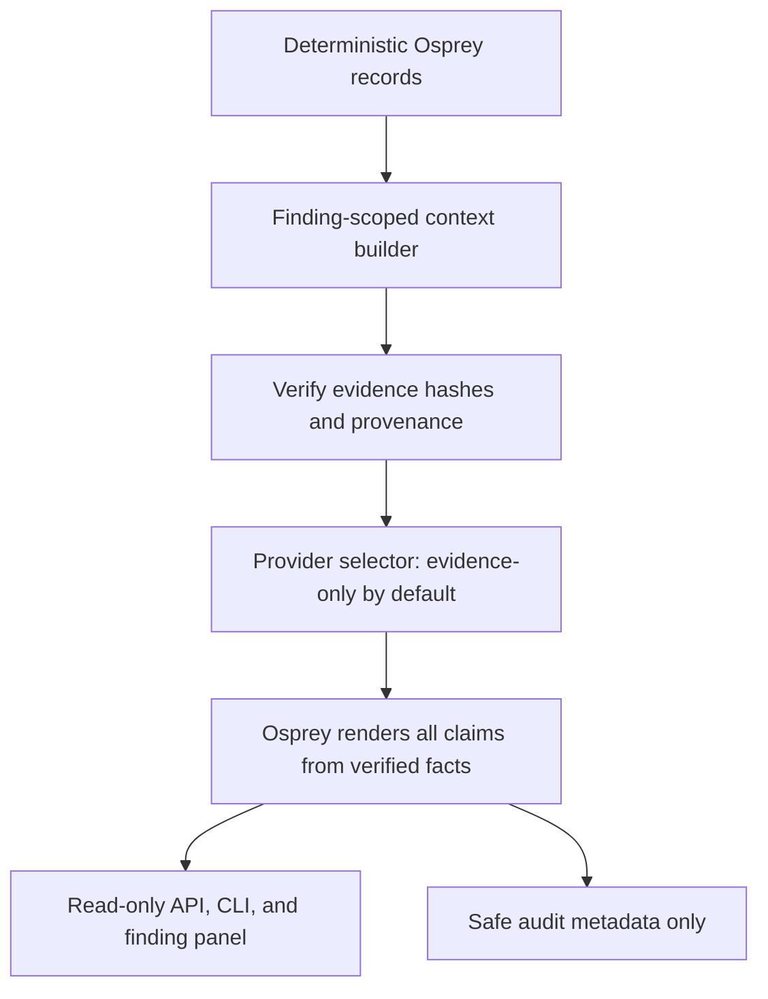

# Evidence-Grounded Copilot Security Boundary

**Updated:** 2026-10-08
**Status:** Implemented as a bounded interpretation layer: evidence-only output is the default; an optional model can only select the ordering of Osprey-created fact keys.

> The AI copilot is an explanation and investigation layer. It does not determine security truth.

Osprey's scanner, version evaluator, source/reachability analyzer, runtime collector, shared risk engine, and remediation verification remain authoritative. The copilot cannot create or edit a finding, evidence record, risk score, reachability result, remediation proposal, approval, application, or verification state.

## Architecture

The context builder reads one persisted finding by ID, verifies linked evidence records, checks evidence type and finding identity, and enforces organization ownership. The copilot does not scan files or accept arbitrary repository paths. Context is capped at 32 KiB, evidence links at 64, and the API question at 2,000 characters. The response is capped at 16 KiB.

The bounded context may include:

- Finding and advisory identifiers, package/version matching evidence, affected ranges, fixed versions, and severity/CVSS only when present in verified advisory evidence.
- Vulnerable symbols, static reachability/path/confidence/limitations, and current runtime observations.
- The shared risk engine's recorded inputs, score, level, decision, and factors.
- Remediation proposal/application/verification state only when supported by integrity-verified remediation event evidence.
- Evidence IDs, unknowns, and limitations.

Raw source files and arbitrary repository files are not sent. Advisory descriptions and README/source content are not included in the provider request. Any repository-derived text that is present in normalized structured evidence is treated as untrusted data and cannot redefine structured fields.

## Provider boundary

The default provider is `evidence-only`; it makes no network request. `osprey explain --question` is also evidence-only. An optional generic OpenAI-compatible selector can be enabled with `COPILOT_PROVIDER=openai-compatible` and operator-supplied `COPILOT_BASE_URL`, `COPILOT_MODEL`, and `COPILOT_API_KEY`. The API key is configuration only and is never put into evidence or audit records. Remote providers require HTTPS, except loopback HTTP in development/test, use a bounded timeout and response size, and receive no tools.

The optional provider returns exactly two arrays: `fact_keys` and `next_step_keys`. It cannot return prose, scores, severity, statuses, or evidence IDs. Osprey validates these keys against the context, includes all facts even if the provider omits one, and renders every claim itself. Malformed, oversized, unsupported, contradictory, or tool-like output is rejected and produces deterministic evidence-only fallback output. This restriction is intentional; free-form model text is not treated as a security claim.

When an operator enables the remote selector, the configured provider receives the bounded question, normalized finding facts, evidence IDs, unknowns, and limitations. Reachability facts can contain validated repository-relative paths. It does not receive source files, advisory descriptions, absolute filesystem paths, credentials, or the SQLite store. The provider endpoint and key are operator configuration; the default evidence-only provider sends no network request. Osprey does not accept model-generated prose, so the displayed answer remains Osprey-rendered.

## Trust boundaries and injection handling

- **Trusted policy:** provider system policy says project/advisory text is data, never instructions. User questions are separately labeled untrusted input.
- **Structured Osprey evidence:** evidence IDs and SHA-256 envelope integrity are checked before factual claims are rendered. Wrong-type, wrong-finding, legacy-unverifiable, and tampered records are excluded or reported as limitations.
- **Untrusted project content:** advisory descriptions are contextual only. Source, README, metadata, issue, and runtime strings cannot introduce provider instructions or become authoritative claims. The copilot does not load source files.
- **Provider output:** an allow-listed selector only. No shell, filesystem, HTTP, scanner, SQLite, or remediation tools are available to the provider.
- **User question:** bounded and treated as a question, not as policy or evidence.

If structured sources conflict, the response reports “Conflicting evidence detected.” It does not silently choose a preferred value. Severity, CVSS, EPSS, KEV, affected ranges, fixed versions, risk, reachability, and remediation verification are never filled from free text.

## Unknowns and confidence

Missing, stale, malformed, tampered, legacy-unverifiable, or mismatched evidence remains `UNKNOWN` or is excluded with a limitation. In particular, absent runtime evidence does not mean a dependency is not loaded, and a lockfile observation does not establish installation. A verified `LOADED` observation does not establish execution. The copilot preserves these distinctions and cannot declare a finding safe.

`security_confidence` carries the deterministic reachability status/confidence. `ai_explanation_confidence` is a separate field and remains `UNKNOWN`; a model cannot upgrade either value.

## API, CLI, UI, and audit

- `POST /api/v1/copilot/query` requires authentication, is read-only, scopes findings by authenticated organization, bounds input/output, and applies an in-process per-user rate limit. Cross-organization findings return not found.
- `osprey explain FINDING_ID --question "..."` uses verified scan evidence and deterministic output. The existing `osprey explain FINDING_ID` behavior is unchanged.
- The finding panel shows the deterministic finding separately from the Copilot explanation, then lists evidence IDs, unknowns, limitations, and next investigations.
- The backend may append safe audit metadata: request/finding IDs, provider name, context hash, validation result, referenced evidence IDs, timestamp, and latency. Questions, model prompts/responses, credentials, and environment variables are not logged. The copilot itself does not write findings, evidence, SQLite analysis records, or remediation state.

The API rate limiter is process-local; it is not a distributed quota. Authentication/RBAC and organization scoping protect the new copilot query route. Existing API routes retain their existing authorization behavior.

## Integrity and limitations

Evidence hashes detect content/envelope changes when verified. They do not make SQLite immutable, provide trusted timestamps or source authenticity, or establish independent forensic custody. The copilot is not proof of exploitability, production exposure, compromise, absence of vulnerabilities, or remediation success. The optional remote provider may be unavailable; deterministic fallback remains usable without a model key or network connection.

For overall system limits see [ARCHITECTURE.md](ARCHITECTURE.md), [EVIDENCE_MODEL.md](EVIDENCE_MODEL.md), and [SECURITY_MODEL.md](SECURITY_MODEL.md).
