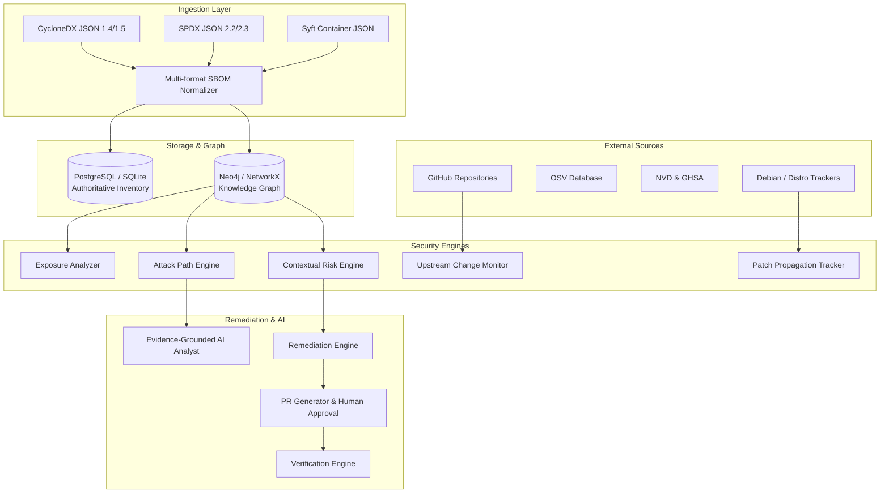

# GuardianOS v2 — System Architecture

## Overview
GuardianOS v2 is an AI-native Software Supply Chain Intelligence and Attack Path Security Platform. Rather than operating as an isolated CVE scanner, GuardianOS correlates multi-format SBOMs, upstream repository signals, container layers, runtime network exposure, and IAM permissions into a unified Knowledge Graph to discover, prioritize, and remediate exploitable attack paths.

## Core Tenets
1. **Never Just a CVE Dashboard**: Vulnerability data is correlated with container hierarchies, runtime ports, unauthenticated endpoints, and lateral privileges.
2. **Three Dependency States**: Always distinguishes between:
   - `DECLARED`: Manifest/lockfile definition.
   - `INSTALLED`: Filesystem / container image package.
   - `RUNNING`: Actively executing production workload.
3. **AI Grounding**: Deterministic graph traversals and structured database records are the sole source of truth. LLMs reason over retrieved facts and cite explicit node IDs.
4. **Human in the Loop**: Remediation tasks generate verifiable Pull Requests requiring human approval prior to deployment and post-fix verification.
