# GuardianOS v2 — Attack Path Engine Specification

## Graph Traversal Architecture
The Attack Path Engine discovers whether an adversary can reach a high-value asset, cloud credential, or sensitive database from an external entry point.

```mermaid
flowchart LR
    A[Attacker / Internet] -->|Public HTTP| B[POST /api/upload]
    B -->|Routes To| C[Image Service]
    C -->|Invokes| D[ImageMagick]
    D -->|Executes Code In| E[libheif Vulnerable 1.19.7]
    E -->|Remote Code Execution| F[Container Filesystem]
    F -->|Escalates Via| G[IAM Service Account]
    G -->|Extracts Data From| H[S3 Customer Bucket]
```

## Traversal Node Taxonomy
1. **Entry Points**: `Internet`, `PublicRoute`, `Webhook`, `LeakedCredential`.
2. **Execution Nodes**: `Service`, `Container`, `Library`, `RuntimeProcess`.
3. **Privilege Transitions**: `ServiceAccount`, `RoleBinding`, `HostMount`.
4. **Target Assets**: `CloudResource`, `Database`, `AgentSecret`, `ProductionRepository`.

## Path Calculation Logic
- Breadth-First and Depth-First Search with cycle detection up to depth $K$.
- Every discovered path must include:
  - `entry_point`: External entry vector.
  - `vulnerable_node`: PURL of the vulnerable library.
  - `privilege_transition`: Service account or IAM role.
  - `target_asset`: High-value resource reached.
  - `confidence_score`: Deterministic confidence based on evidence signals.
